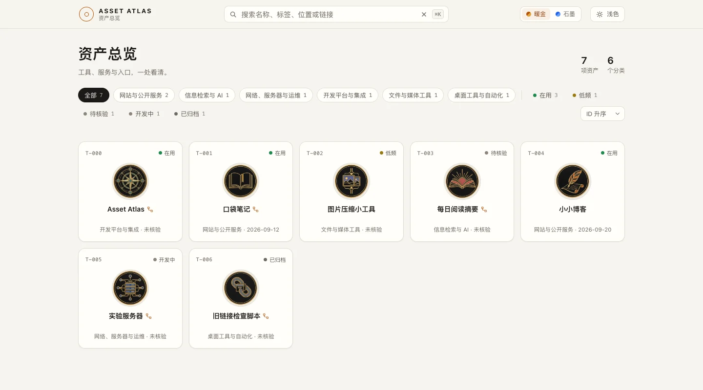
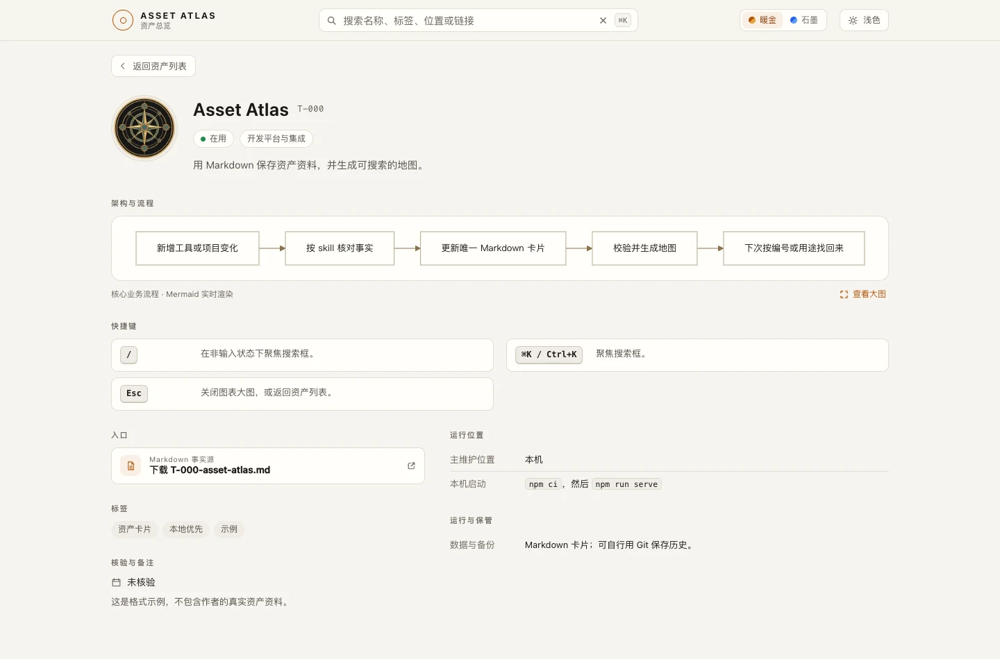

# Asset Atlas · 个人资产地图

中文｜[English](README.en.md)

AI 时代，敲钉子越来越容易，做过的项目却散落各处。Asset Atlas 把它们收进一座资产收藏馆：用途、代码位置、启动方式和部署信息一目了然，支持本地查看和私有部署。


[在线体验](https://asset-atlas-nu.vercel.app) ·  [制作我的第一张卡](#制作我的第一张卡) · [使用指南](docs/usage.md)





## 制作我的第一张卡

运行命令，按提示选择编程助手：

```sh
npx skills add xPeiPeix/asset-atlas --skill manage-asset-atlas -g
```

安装后，在自己的项目里对助手说：

> 使用 manage-asset-atlas，把当前项目做成第一张资产卡；资产库放在 ~/my-asset-atlas，不存在就创建，并打开本地预览。

[完整指令](skills/manage-asset-atlas/references/first-card.md#完整可复制指令) · [本地查看与隐私](docs/local-use-and-privacy.md)

## 一键部署私有的资产典藏库

[](https://vercel.com/new/clone?repository-url=https%3A%2F%2Fgithub.com%2FxPeiPeix%2Fasset-atlas&project-name=asset-atlas&repository-name=asset-atlas)

选择私有仓库，开启 **Vercel Authentication → All Deployments**（免费），再放入私人卡片。[设置步骤](docs/usage.md#部署到-vercel)


[MIT](LICENSE) · [反馈](https://github.com/xPeiPeix/asset-atlas/issues) ·  **Star** 。

友情链接：[LINUX DO](https://linux.do/)
