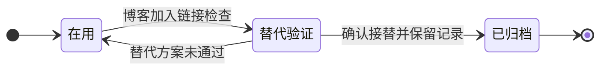

# T-006 · 旧链接检查脚本

> 定期检查博客里的外部链接是否可访问。

| 字段 | 内容 |
|---|---|
| 状态 | 🧊 已归档 |
| 分类 | 桌面工具与自动化 |
| 标签 | `归档`、`链接检查`、`示例` |
| 头像 | [查看](../assets/avatars/T-006.webp) |
| 头像意象 | 链环与归档盒 · 石板灰 #76818D |
| 主维护位置 | 本机 |
| 本机目录 | `~/Projects/old-link-checker` |
| 最近核验 | 未核验 |
| 归档日期 | 2026-09-01 |
| 归档原因 | 示例：已由博客构建流程接替。 |
| 备注 | 虚构归档记录。保留原编号，以后仍可查到它曾经做什么。 |

## 核心业务流程

