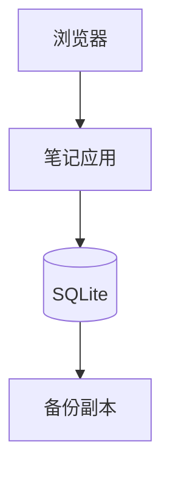

# T-001 · 口袋笔记

> 保存零散想法，在需要时按关键词找回来。

| 字段 | 内容 |
|---|---|
| 状态 | 🟢 在用 |
| 分类 | 网站与公开服务 |
| 标签 | `笔记`、`SQLite`、`示例` |
| 主维护位置 | 本机 + 示例服务器 |
| 本机目录 | `~/Projects/pocket-notes` |
| 本机启动 | `npm run dev`，以终端打印的地址为准。 |
| 生产网站 | [示例入口](https://notes.example.invalid) |
| SSH 主机 | `host-example` |
| 数据与备份 | 示例：SQLite 文件，备份到自选备份目录。 |
| Secrets 位置 | 示例：用户自己的密码管理器；此处不保存值。 |
| 最近核验 | 未核验 |
| 备注 | 虚构应用，用来展示有部署和数据的资产如何记录。 |

## 系统架构

