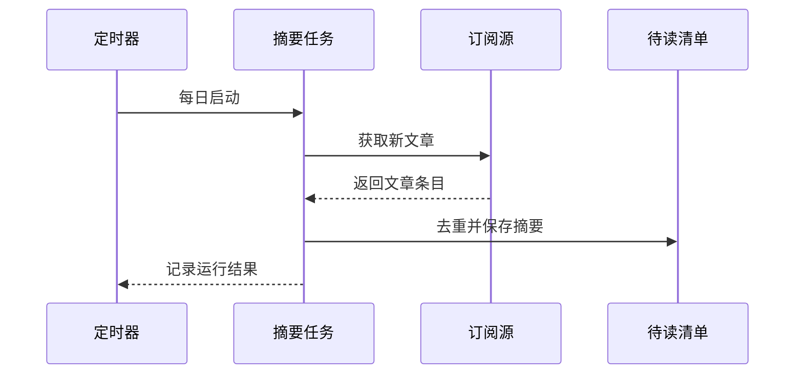

# T-003 · 每日阅读摘要

> 把订阅源的新文章汇总成一份待读清单。

| 字段 | 内容 |
|---|---|
| 状态 | ⚪ 待核验 |
| 分类 | 信息检索与 AI |
| 标签 | `RSS`、`后台任务`、`示例` |
| 头像 | [查看](../assets/avatars/T-003.webp) |
| 头像意象 | 展开纸页与朝阳 · 暗珊瑚 #B75B62 |
| 主维护位置 | 示例服务器 |
| SSH 主机 | `host-example` |
| 运行方式 | 示例：每日由 systemd timer 运行，无公开网站。 |
| 日志位置 | 示例：`journalctl -u daily-digest` |
| 核验待办 | 检查最近一次运行结果，以及订阅源是否仍有效。 |
| 最近核验 | 未核验 |
| 备注 | 虚构任务。“没有网页入口”不等于“不需要登记”。 |

## 核心业务流程

