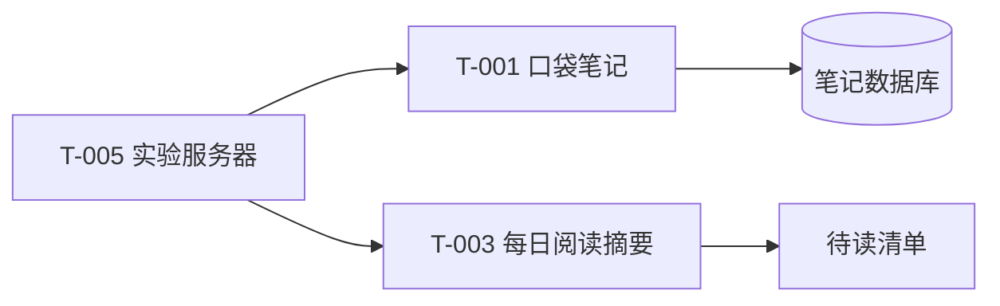

# T-005 · 实验服务器

> 为笔记和每日摘要提供一处可定位的运行环境。

| 字段 | 内容 |
|---|---|
| 状态 | 🧪 开发中 |
| 分类 | 网络、服务器与运维 |
| 标签 | `服务器`、`关联资产`、`示例` |
| 头像 | [查看](../assets/avatars/T-005.webp) |
| 头像意象 | 三层服务器塔与连接节点 · 钴石蓝 #4B68A1 |
| 主维护位置 | 示例云主机 |
| SSH 主机 | [SSH 入口示例](ssh://host-example) · `host-example` |
| 关联资产 | `T-001` 口袋笔记、`T-003` 每日阅读摘要 |
| Secrets 位置 | 示例：本机 SSH 配置及用户自行管理的密钥；不记录密钥内容。 |
| 最近核验 | 未核验 |
| 备注 | 虚构主机；SSH 链接使用示例别名，使用时换成自己的 SSH 配置。先记录负责运行哪些工具，再补真正需要的运维信息。 |

## 系统架构

